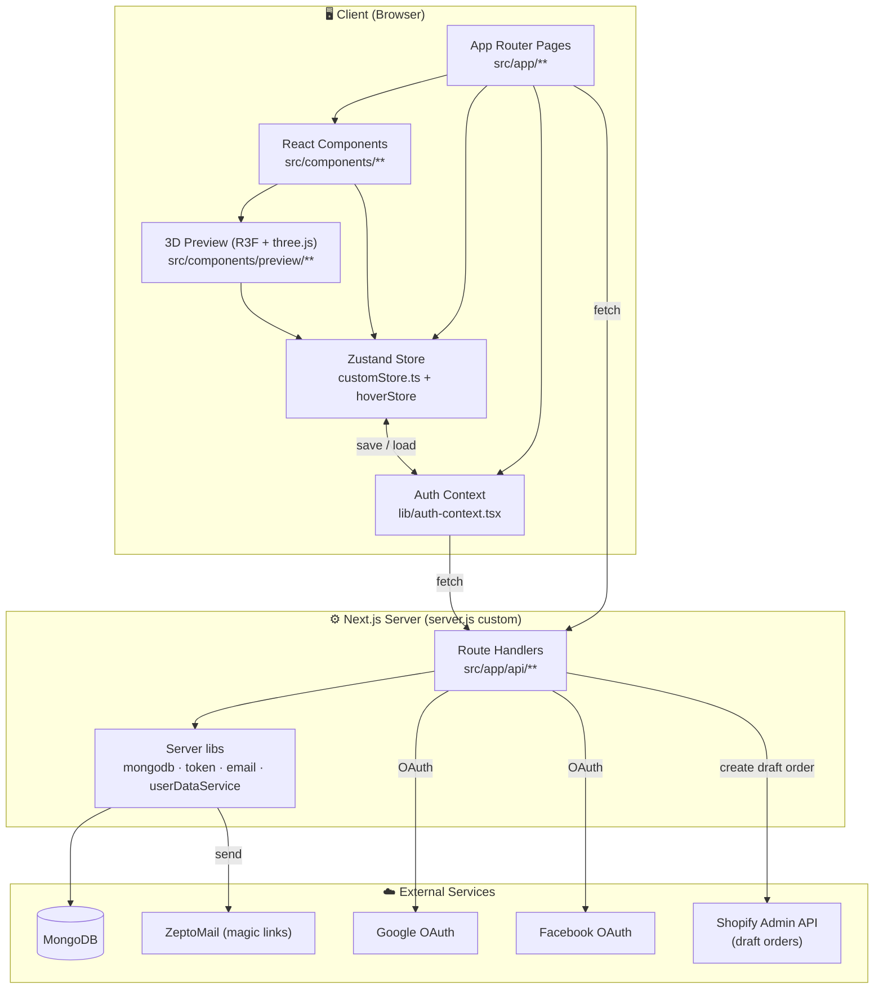
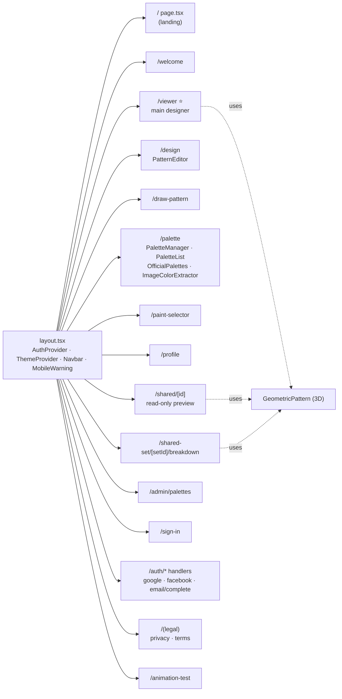
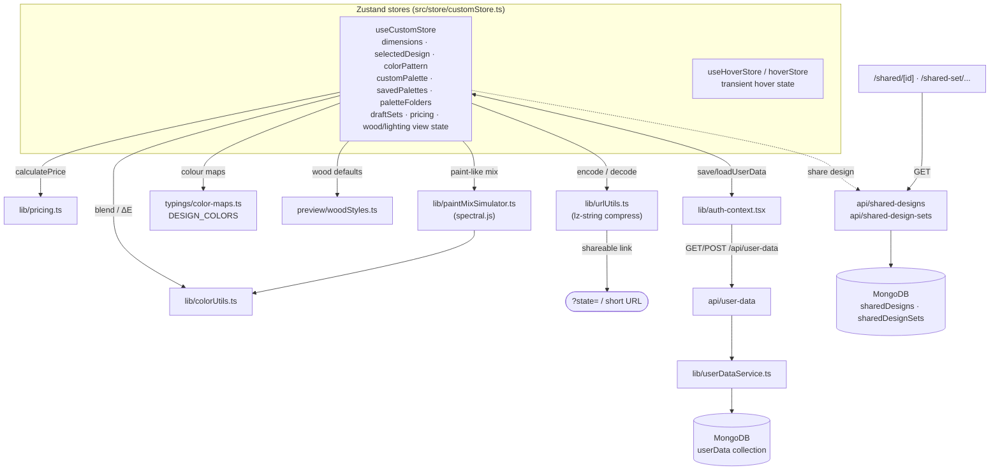
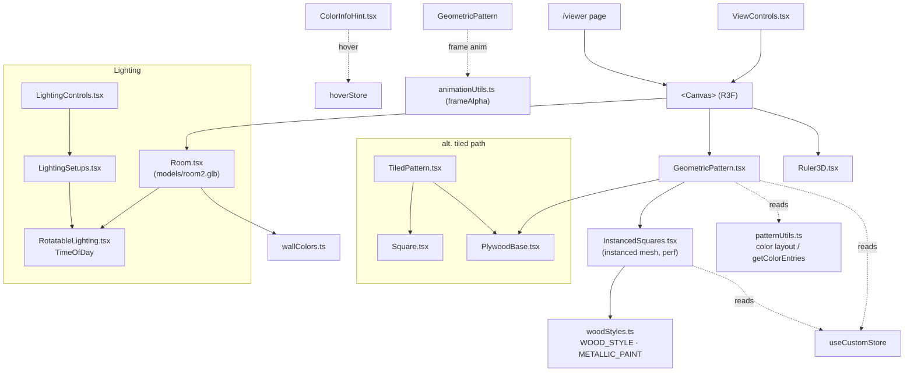
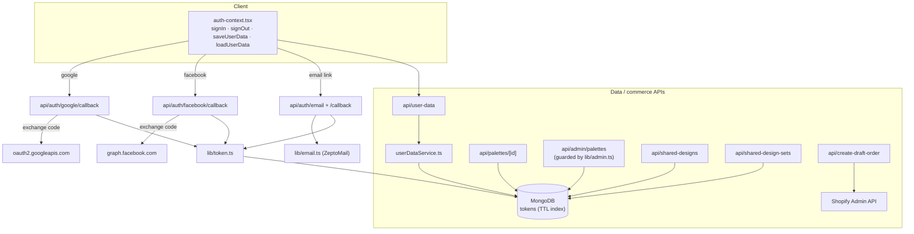
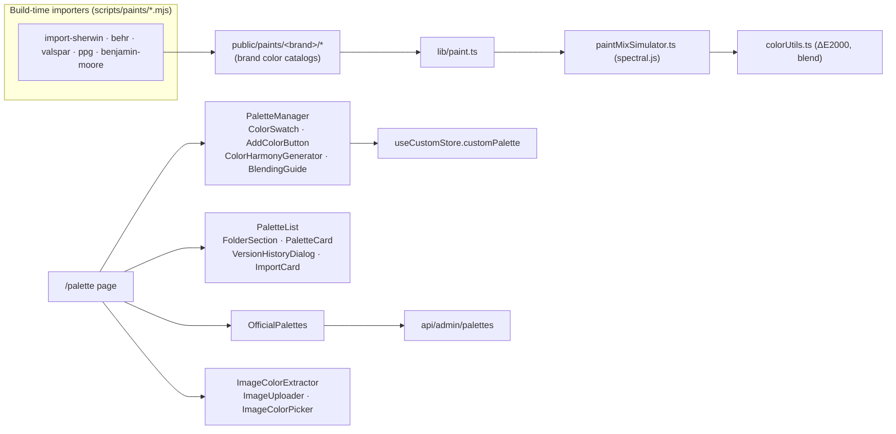

# Custom-Request — Architecture

A **Next.js 16 / React 19** web app for designing custom geometric wood art. Users pick a
size + design, customize a color palette, preview it in an interactive **React Three Fiber**
3D scene, share it via URL or saved set, and check out through **Shopify**. State lives in a
large **Zustand** store; persistence is **MongoDB**; auth is custom (Google / Facebook / email
magic-link).

---

## 1. High-level layers



---

## 2. App Router page map



---

## 3. State, persistence & sharing data flow



---

## 4. 3D preview render pipeline (React Three Fiber)



---

## 5. Auth & API routes



---

## 6. Paint & palette subsystem



---

## Tech stack quick reference

| Concern | Tech |
|---|---|
| Framework | Next.js 16 (App Router) + custom `server.js`, React 19, TypeScript |
| 3D | three.js, @react-three/fiber, @react-three/drei, @react-spring/three |
| State | Zustand (`customStore.ts`, `hoverStore`) |
| Styling/UI | Tailwind CSS, shadcn/ui (`components/ui/*`), Radix, framer-motion, lucide |
| Data | MongoDB (`userData`, `tokens`, `sharedDesigns`, `sharedDesignSets`) |
| Auth | Custom — Google + Facebook OAuth, email magic-link, token TTL in Mongo |
| Commerce | Shopify Admin API (draft orders) |
| Color science | spectral.js (Kubelka–Munk mix), ΔE2000 in `colorUtils.ts` |
| Sharing | `lz-string`-compressed URL state + Mongo-backed share links |
| Email | ZeptoMail |
```
